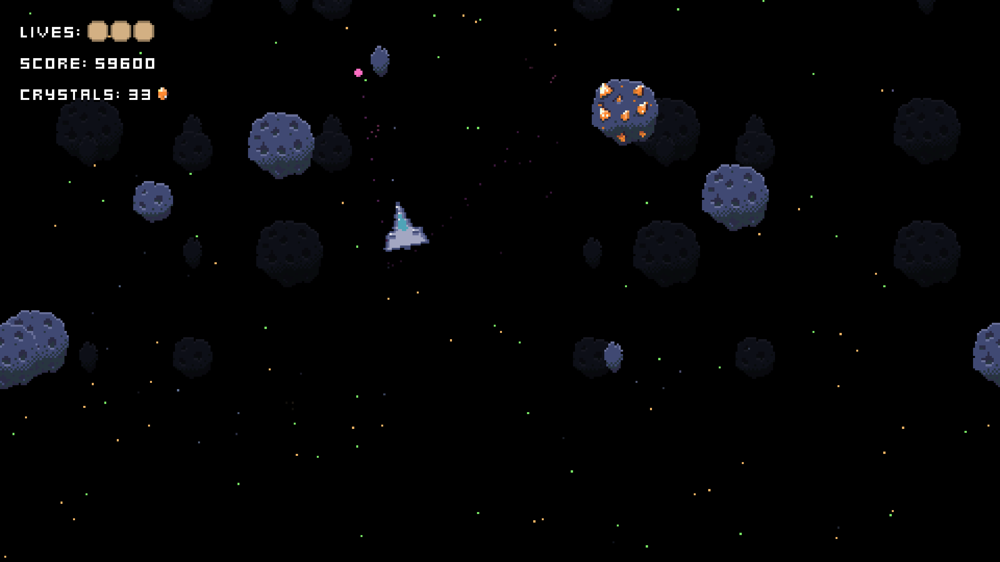
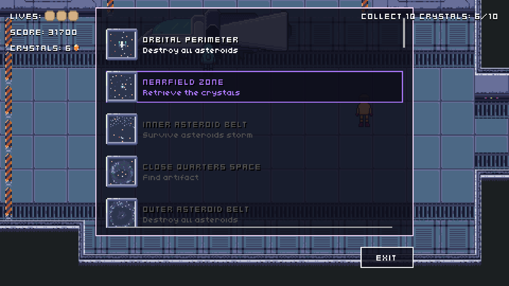
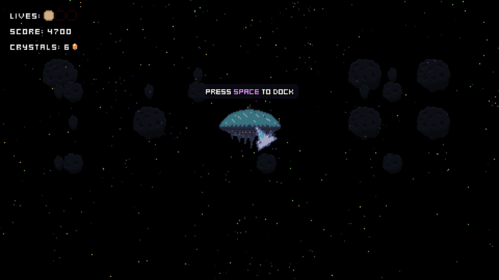
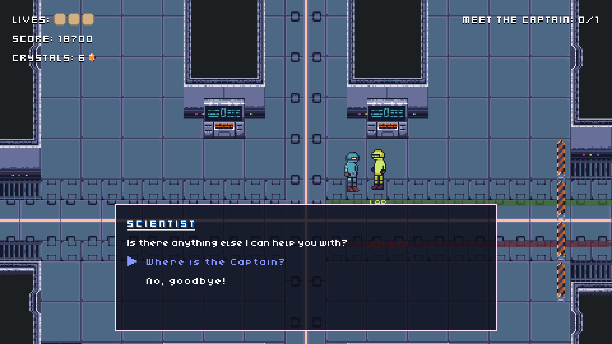
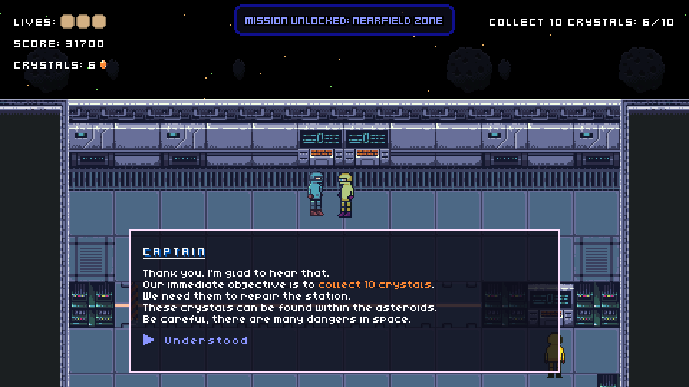
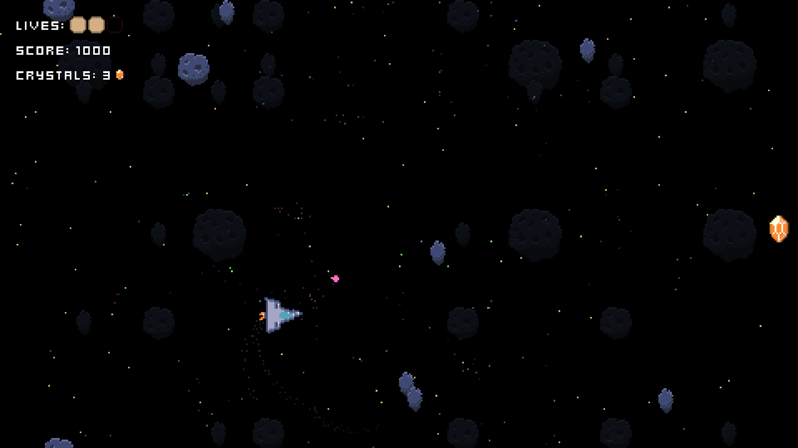

# Space Something - Raylib Slo-Jam 2023 Game Jam Entry

## [PLAY HERE](https://zyper.itch.io/space-something)

### Description

Winner in Quality and Polish category of the Raylib Slo-Jam 2023 Game Jam. Developed in C++20 with raylib. This project is an Asteroids-inspired game with RPG elements.

### Controls

Keyboard:
 * Arrows to move
 * Spacebar to shoot and interact
 * M to mute 

### License

This game source code and assets are licensed under GPL-3.0 License. Check [LICENSE](LICENSE) for further details.

*Copyright (c) 2023 Kacper Zybała @zyperpl*
